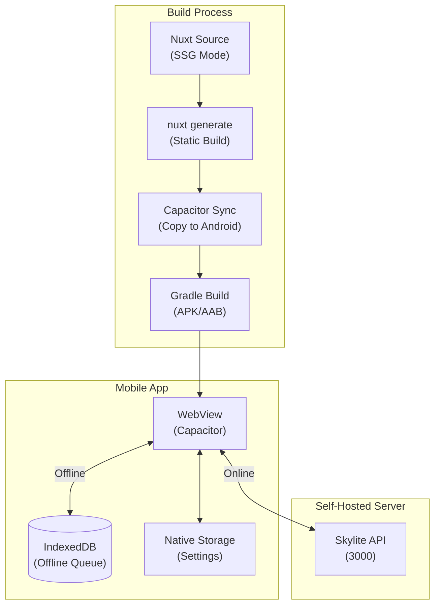
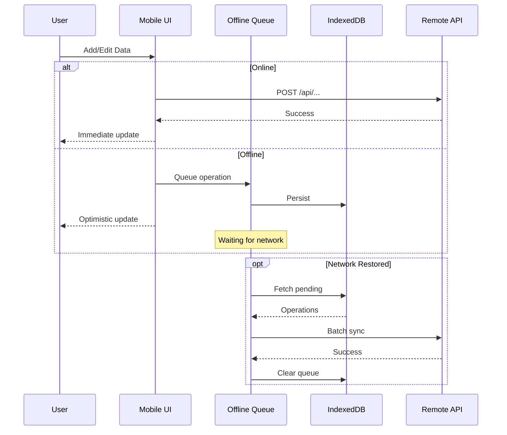

# Architecture & Tech Stack

This document provides a comprehensive overview of the Skylight (SkyLite UX) architecture, technology stack, and system design.

---

## Project Overview

**Skylight** is an open-source, self-hosted family management application serving as an alternative to commercial offerings like Google Family Link. It provides a comprehensive dashboard for managing family calendars, tasks, shopping lists, and meal planning.

### Core Features

| Feature               | Description                                                   |
| --------------------- | ------------------------------------------------------------- |
| **Calendar**          | View and manage family events with day, week, and month views |
| **Todo Lists**        | Track tasks for family members with priority and due dates    |
| **Shopping Lists**    | Collaborative shopping list management                        |
| **Meal Planning**     | Weekly meal planning with breakfast, lunch, and dinner        |
| **Weather Widget**    | Real-time weather display on the dashboard                    |
| **Photo Backgrounds** | Dynamic backgrounds from Google Photos                        |

---

## System Architecture

Skylight follows a **monolithic full-stack architecture** with a Nuxt 4 frontend and Nitro backend, connected to a PostgreSQL database and multiple external integrations.


### Architecture Characteristics

- **Single Codebase**: Frontend and backend coexist in the same project
- **Unified Build**: Nuxt handles both frontend (`app/`) and backend (`server/`) compilation
- **Shared Types**: Single TypeScript type system used across the full stack
- **SSR Enabled**: Server-side rendering with client-side hydration
- **Real-time Sync**: WebSocket/EventSource capability via Nitro Sync Manager

---

## Tech Stack

### Frontend Technologies

| Technology       | Version | Purpose                     |
| ---------------- | ------- | --------------------------- |
| **Nuxt**         | 4.0.1   | Vue meta-framework with SSR |
| **Vue.js**       | 3.5.13  | Reactive UI framework       |
| **Vue Router**   | 4.5.0   | Client-side routing         |
| **TypeScript**   | 5.8.2   | Type-safe JavaScript        |
| **Pinia**        | 3.0.1   | State management            |
| **Nuxt UI**      | 3.1.2   | Component library           |
| **Tailwind CSS** | -       | Utility-first CSS           |
| **VueUse**       | 10.9.0  | Vue composition utilities   |
| **date-fns**     | 3.3.1   | Date manipulation           |
| **ical.js**      | 2.2.0   | iCalendar parsing           |

### Backend Technologies

| Technology     | Version | Purpose                        |
| -------------- | ------- | ------------------------------ |
| **Nitro**      | -       | Server runtime (Nuxt built-in) |
| **Node.js**    | 20      | JavaScript runtime             |
| **Prisma**     | 6.9.0   | Database ORM                   |
| **googleapis** | 170.0.0 | Google API client              |
| **consola**    | 3.4.2   | Logging                        |

### Database

| Technology     | Version | Purpose                        |
| -------------- | ------- | ------------------------------ |
| **PostgreSQL** | 16      | Primary relational database    |
| **Prisma**     | 6.9.0   | Schema management & migrations |

### DevTools

| Tool         | Version | Purpose             |
| ------------ | ------- | ------------------- |
| **Vite**     | 6.3.5   | Build tool          |
| **ESLint**   | 9.27.0  | Code linting        |
| **Prettier** | 3.5.2   | Code formatting     |
| **vue-tsc**  | 2.2.10  | TypeScript checking |

---

## Application Structure


### Frontend Structure (`app/`)

| Directory       | Purpose                                                                                       |
| --------------- | --------------------------------------------------------------------------------------------- |
| `pages/`        | Route pages (home, calendar, toDoLists, shoppingLists, mealPlanner, settings)                 |
| `components/`   | Vue components organized by feature (calendar, global, home, shopping, mealPlanner, settings) |
| `composables/`  | 22 Vue 3 Composition API hooks for business logic                                             |
| `plugins/`      | App initialization (logging, appInit, syncManager)                                            |
| `integrations/` | Client-side integration service definitions                                                   |
| `types/`        | Shared TypeScript type definitions                                                            |

### Backend Structure (`server/`)

| Directory       | Purpose                                                      |
| --------------- | ------------------------------------------------------------ |
| `api/`          | RESTful API endpoints with file-based routing                |
| `integrations/` | Server-side integration implementations                      |
| `plugins/`      | Server initialization (logging, syncManager)                 |
| `utils/`        | Utilities (Google OAuth config, RRule parsing, sanitization) |

---

## Database Schema

The application uses PostgreSQL with Prisma ORM, featuring 12 interconnected data models.


### Data Models

| Model                 | Purpose                                                  |
| --------------------- | -------------------------------------------------------- |
| **User**              | User accounts with profile (name, email, avatar, color)  |
| **TodoColumn**        | Todo list containers per user                            |
| **Todo**              | Individual task items with priority and due dates        |
| **CalendarEvent**     | Calendar events with recurrence (iCal format)            |
| **CalendarEventUser** | Many-to-many relationship for event participants         |
| **ShoppingList**      | Shopping list containers                                 |
| **ShoppingListItem**  | Individual shopping items with quantity/units            |
| **MealPlan**          | Weekly meal plan containers                              |
| **Meal**              | Individual meals (breakfast/lunch/dinner)                |
| **Integration**       | External service configurations (OAuth tokens, API keys) |
| **AppSettings**       | Global application settings (singleton)                  |

---

## External Integrations

Skylight features a modular integration system for connecting to external services.


### Integration Capabilities

| Integration         | Auth Method | Capabilities                                         |
| ------------------- | ----------- | ---------------------------------------------------- |
| **Google Calendar** | OAuth 2.0   | Read/Write events, multiple calendars, color support |
| **Google Photos**   | OAuth 2.0   | Album fetching, dynamic photo backgrounds            |
| **iCal Feeds**      | URL-based   | Read-only calendar import, RFC 5545 compliant        |
| **Mealie**          | API Key     | Shopping list sync (Add/Clear/Edit)                  |
| **Tandoor**         | API Key     | Shopping list sync (Add/Edit)                        |

---

## Deployment Architecture

Skylight is designed for self-hosted deployment using Docker.


### Docker Configuration

**Container: skylite-ux**

- Base image: Node.js 20
- Build: Multi-stage Dockerfile
- Exposed port: 3000
- Auto-migration on startup
- Health check enabled

**Container: postgres**

- Image: postgres:16
- Internal port: 5432
- Persistent volume: postgres-data
- Health check: pg_isready

### Environment Variables

| Variable               | Required | Description                  |
| ---------------------- | -------- | ---------------------------- |
| `DATABASE_URL`         | Yes      | PostgreSQL connection string |
| `GOOGLE_CLIENT_ID`     | No       | Google OAuth client ID       |
| `GOOGLE_CLIENT_SECRET` | No       | Google OAuth client secret   |

---

## Mobile Architecture

Skylite UX is available as a native Android application using Capacitor, providing offline-first functionality with a mobile-optimized UI.



### Mobile Platform Details

| Aspect                | Details                                                |
| --------------------- | ------------------------------------------------------ |
| **Platform**          | Android (APK/AAB)                                      |
| **Framework**         | Capacitor 6.2.0                                        |
| **Build Mode**        | Static Site Generation (SSG)                           |
| **Rendering**         | Client-side only (SSR disabled)                        |
| **Offline Support**   | IndexedDB-based queue with auto-sync                   |
| **Native Features**   | Preferences API for server URL and settings            |
| **PWA Support**       | Progressive Web App as alternative installation method |
| **Distribution**      | GitHub Releases (APK), Google Play Store (planned)     |

### Static Site Generation (SSG)

The mobile app uses static site generation instead of server-side rendering:

```typescript
// nuxt.config.ts
export default defineNuxtConfig({
  // Disable SSR for Capacitor builds
  ssr: process.env.CAPACITOR_BUILD !== "true",

  // Disable server plugins during static generation
  nitro: {
    plugins: process.env.CAPACITOR_BUILD === "true"
      ? []
      : ["../server/plugins/01.logging.ts", "../server/plugins/02.syncManager.ts"],
    prerender: process.env.CAPACITOR_BUILD === "true"
      ? { routes: [] }
      : undefined,
  },
})
```

**Why Static Generation?**

- Self-contained app that works without a bundled server
- Smaller APK size (no Node.js server code)
- Better performance on mobile devices
- Users connect to their own self-hosted Skylite server
- Standard Capacitor architecture pattern

### Offline-First Architecture

The mobile app implements offline-first architecture with automatic synchronization:



**Offline Features:**

- **Offline Queue**: All create/update/delete operations queued in IndexedDB
- **Optimistic Updates**: UI updates immediately, syncs in background
- **Auto-Sync**: Automatic synchronization when network is restored
- **Conflict Resolution**: Server data takes precedence on sync
- **Queue Management**: View pending operations in `/offline-queue` page

**Supported Offline Operations:**

| Feature          | Create | Update | Delete |
| ---------------- | ------ | ------ | ------ |
| Todos            | ✅      | ✅      | ✅      |
| Meals            | ✅      | ✅      | ✅      |
| Shopping Items   | ✅      | ✅      | ✅      |
| Calendar Events  | ❌      | ❌      | ❌      |

### Mobile-Optimized UI

The mobile app features responsive design with mobile-specific enhancements:

**Collapsible Columns:**
```vue
<!-- Todo lists and shopping lists collapse by default on mobile -->
<div v-if="isListExpanded(list.id)" class="hidden md:block">
  <!-- Column content -->
</div>
```

**Responsive Layout:**
- Fixed 50px sidebar on all screen sizes
- Content area adjusts: `left-[50px]` for modals and overlays
- No horizontal scrollbars: `overflow-x-hidden` on container elements
- Touch-optimized tap targets (minimum 44x44px)

**State Preservation:**
- Accordion states preserved after data operations
- Vue `nextTick()` ensures correct render timing
- Watchers restore UI state after API responses

### Server Configuration

The mobile app requires configuration of the self-hosted server URL:

```typescript
// On first launch, user is redirected to /mobile-settings
const { Preferences } = await import("@capacitor/preferences");
await Preferences.set({
  key: "serverUrl",
  value: "https://skylite.example.com"
});

// All API calls are intercepted and routed to configured server
window.__CAPACITOR_SERVER_URL__ = serverUrl;
```

**Configuration Flow:**

1. User launches app for first time
2. No server URL → redirect to `/mobile-settings`
3. User enters server URL (e.g., `https://skylite.example.com`)
4. URL saved to native Preferences
5. All `$fetch` calls intercepted and routed to configured server
6. App functions normally, syncing with user's self-hosted instance

### Build Process

Mobile builds use GitHub Actions with automated APK generation:

```yaml
# .github/workflows/build-apk.yml
- name: Build APK
  run: |
    export CAPACITOR_BUILD=true
    npm run generate
    npx cap sync android
    cd android && ./gradlew assembleRelease
```

**Build Steps:**

1. **Static Generation**: `nuxt generate` with `CAPACITOR_BUILD=true`
2. **Capacitor Sync**: Copy built files to `android/app/src/main/assets/public`
3. **Gradle Build**: Compile Android APK with signed release configuration
4. **Upload Release**: Attach APK to GitHub release automatically

**Build Outputs:**

- `app-release.apk` - Unsigned APK for sideloading
- `app-release.aab` - Signed bundle for Play Store (future)

### Mobile vs. Web Comparison

| Feature               | Web (SSR)                 | Mobile (SSG)                     |
| --------------------- | ------------------------- | -------------------------------- |
| **Rendering**         | Server + Client           | Client-only                      |
| **Server Required**   | Yes (Nitro)               | No (static files)                |
| **Installation**      | Browser URL               | APK install or PWA               |
| **Offline Support**   | Service Worker (limited)  | Full offline queue with IndexedDB|
| **Server URL**        | Same domain               | Configurable (user's server)     |
| **Native Features**   | None                      | Native storage, notifications    |
| **Distribution**      | Self-hosted URL           | GitHub Releases, Play Store      |
| **Updates**           | Automatic (reload page)   | Manual (download new APK)        |

### Progressive Web App (PWA)

As an alternative to the native APK, users can install Skylite as a PWA:

```typescript
// nuxt.config.ts
pwa: {
  registerType: "autoUpdate",
  manifest: {
    name: "SkyLite UX",
    short_name: "SkyLite",
    theme_color: "#0ea5e9",
    display: "standalone",
    icons: [
      { src: "/skylite-192.png", sizes: "192x192", type: "image/png" },
      { src: "/skylite-512.png", sizes: "512x512", type: "image/png" },
    ],
  },
}
```

**PWA Features:**

- Install from browser on any device (Android, iOS, desktop)
- Works with self-hosted server (no Capacitor configuration needed)
- Service worker for offline caching
- Home screen icon with app-like experience
- No app store required

**PWA vs. Native APK:**

| Aspect               | PWA                     | Native APK                |
| -------------------- | ----------------------- | ------------------------- |
| **Installation**     | Add to Home Screen      | APK install               |
| **Offline Support**  | Service Worker cache    | Full offline queue        |
| **Native APIs**      | Limited                 | Full Capacitor access     |
| **Updates**          | Automatic               | Manual (new APK)          |
| **File Size**        | Cached as needed        | ~8MB APK                  |
| **Distribution**     | Web browser             | GitHub Releases           |

---

## API Endpoints

The application exposes 71+ RESTful API endpoints organized by resource.

| Resource            | Base Path              | Operations                   |
| ------------------- | ---------------------- | ---------------------------- |
| **Calendar Events** | `/api/calendar-events` | CRUD, recurrence expansion   |
| **Users**           | `/api/users`           | CRUD, profile management     |
| **Todo Columns**    | `/api/todo-columns`    | CRUD, reordering             |
| **Todos**           | `/api/todos`           | CRUD, completion toggle      |
| **Shopping Lists**  | `/api/shopping-lists`  | CRUD, item management        |
| **Meal Plans**      | `/api/meal-plans`      | CRUD, meal assignment        |
| **Integrations**    | `/api/integrations/*`  | OAuth flows, sync operations |
| **App Settings**    | `/api/app-settings`    | Get/Update global settings   |
| **Home Settings**   | `/api/home-settings`   | Dashboard widget config      |

---

## Data Flow


---

## Architecture Summary

| Aspect                | Details                            |
| --------------------- | ---------------------------------- |
| **Architecture Type** | Monolithic Full-Stack              |
| **Rendering**         | Server-Side Rendered (SSR)         |
| **Language**          | TypeScript (full stack)            |
| **Frontend**          | Nuxt 4, Vue 3, Pinia, Tailwind CSS |
| **Backend**           | Nitro, Node.js 20                  |
| **Database**          | PostgreSQL 16 with Prisma ORM      |
| **Deployment**        | Docker with Docker Compose         |
| **Real-time**         | WebSocket-based sync system        |

### Design Principles

- **Open-source & Privacy-first**: Self-hosted with no external dependencies
- **Type Safety**: TypeScript across the entire stack
- **Modularity**: Plugin-based integration system
- **Modern Patterns**: Vue 3 Composition API, file-based routing
- **Docker-native**: Containerized deployment with orchestration support
